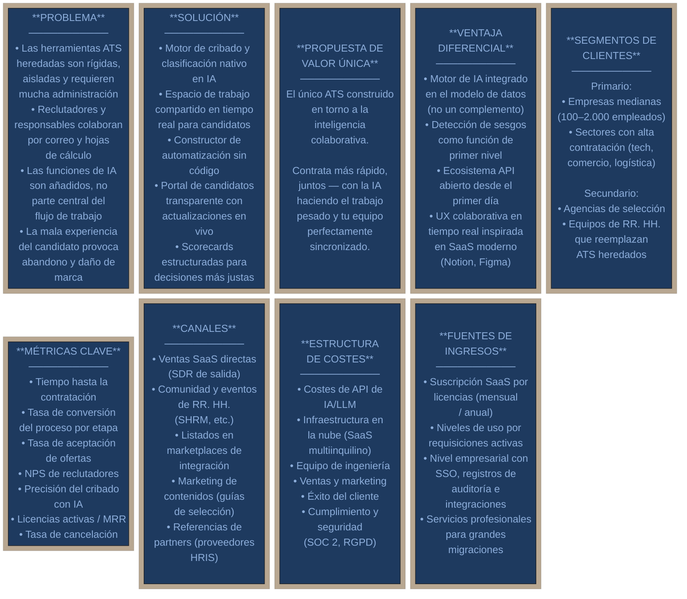
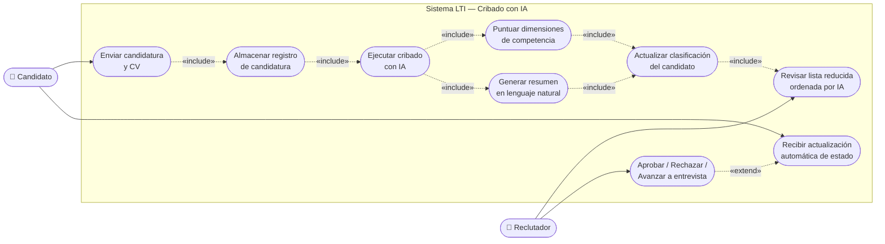
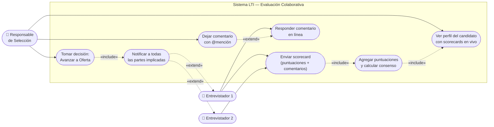
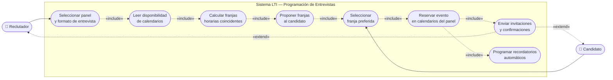
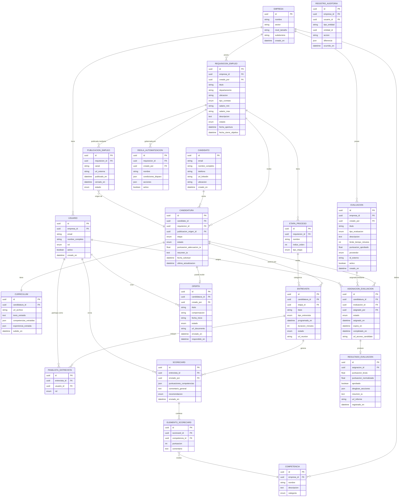
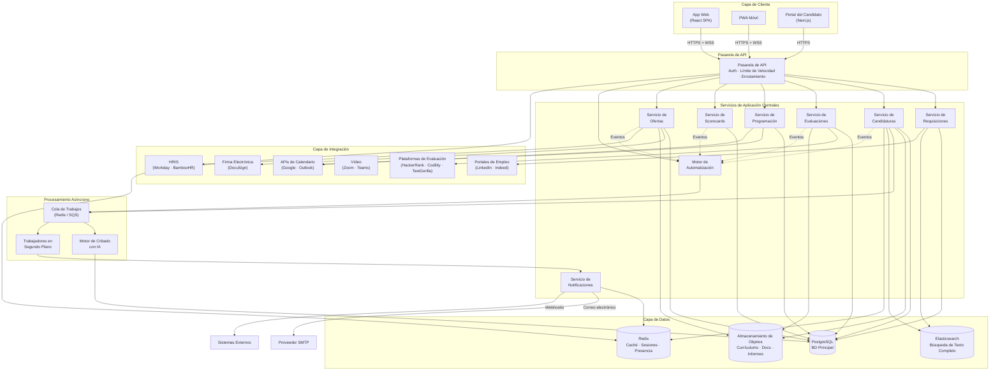
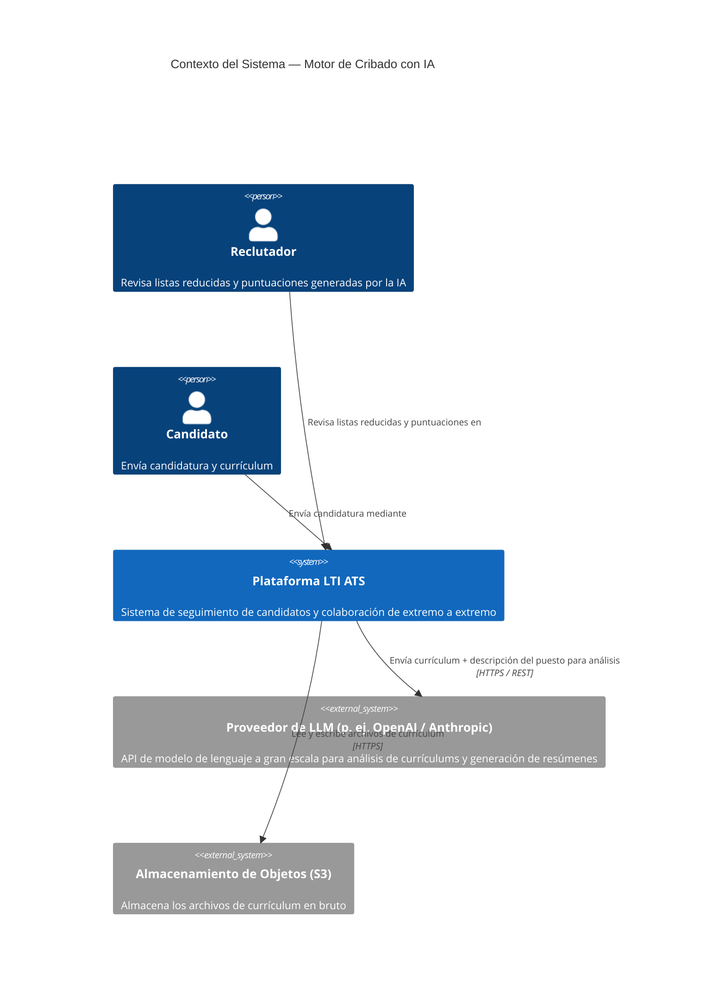
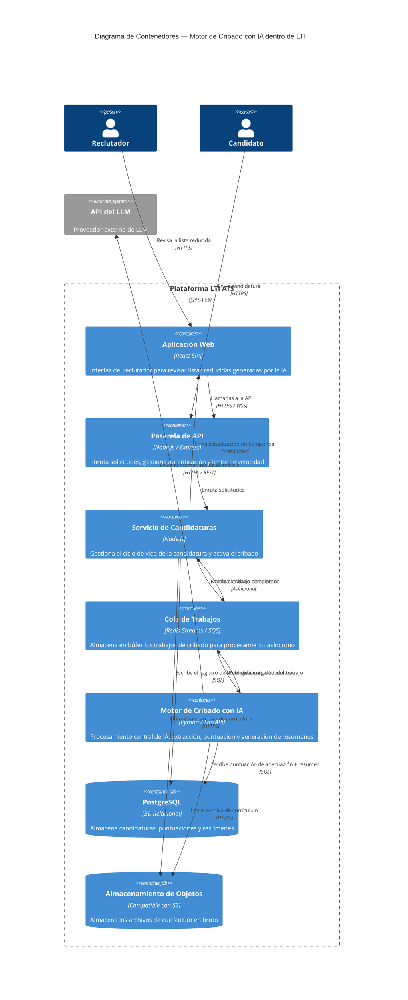
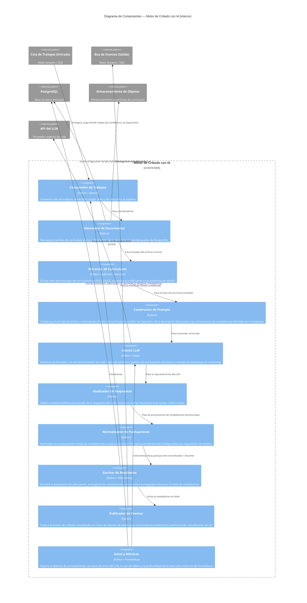

# LTI — Sistema de Seguimiento de Candidatos del Futuro

> **Versión del documento:** 1.0 · **Autor:** Equipo de Estrategia de Producto · **Estado:** Diseño Inicial

---

## Tabla de Contenidos

1. [Descripción General del Producto](#1-descripción-general-del-producto)
2. [Funciones Principales](#2-funciones-principales)
3. [Lean Canvas](#3-lean-canvas)
4. [Casos de Uso](#4-casos-de-uso)
5. [Modelo de Datos](#5-modelo-de-datos)
6. [Diseño del Sistema a Alto Nivel](#6-diseño-del-sistema-a-alto-nivel)
7. [Diagrama C4 — Motor de Cribado con IA](#7-diagrama-c4--motor-de-cribado-con-ia)

---

## 1. Descripción General del Producto

> Esta sección establece los fundamentos estratégicos de LTI. Define qué es el producto, por qué existe y en qué aspectos supera a las soluciones existentes. El objetivo es ofrecer a cualquier lector —inversor, ingeniero o nuevo miembro del equipo— una comprensión clara e inmediata de la identidad del producto, el problema que resuelve y las ventajas que lo hacen defensible en el mercado.

### ¿Qué es LTI?

**LTI** (Let's Track It) es un Sistema de Seguimiento de Candidatos de nueva generación, construido desde cero para la forma en que las empresas modernas contratan realmente. Mientras que las plataformas ATS heredadas fueron diseñadas para almacenar y filtrar currículums, LTI está diseñado para **orquestar toda la experiencia de contratación** — conectando a los reclutadores, los responsables de selección y los candidatos en un único espacio de trabajo inteligente.

LTI va más allá del seguimiento. Asiste activamente en cada etapa del ciclo de vida de la contratación — desde la creación de ofertas de empleo y su publicación en múltiples canales, hasta la recepción y revisión de candidaturas, la realización de evaluaciones en línea, la programación de entrevistas y la formalización de la contratación — todo ello impulsado por IA y visible para todo el equipo de selección en tiempo real.

### Valor Añadido

| Dimensión | ATS Heredado | LTI |
|---|---|---|
| **Paradigma central** | Base de datos de currículums + flujo de trabajo | Plataforma colaborativa de inteligencia para la contratación |
| **Colaboración** | Hilos de correo y hojas de cálculo fuera de la herramienta | Espacio de trabajo nativo en tiempo real para reclutadores y responsables |
| **Automatización** | Disparadores basados en reglas | Automatización contextual impulsada por IA |
| **Experiencia del candidato** | Portales de solicitud estáticos | Procesos personalizados y conversacionales |
| **Calidad de las decisiones** | Intuición y filtros de palabras clave | Datos estructurados, puntuación y alertas de sesgo |
| **Tiempo hasta la contratación** | Semanas de coordinación manual | Reducción drástica mediante colaboración asíncrona y programación inteligente |

### Ventajas Competitivas

1. **IA de Base, no Añadida** — el motor de IA está integrado en el modelo de datos central, no es un módulo adicional. Cada dato del candidato está disponible de inmediato para su análisis inteligente.
2. **Scorecards Colaborativas en Tiempo Real** — los responsables de selección y los reclutadores visualizan el mismo perfil del candidato simultáneamente, dejan comentarios estructurados y llegan a un consenso sin salir de la plataforma.
3. **Automatización sin Código** — un constructor de flujos de trabajo intuitivo permite a los equipos de RR. HH. automatizar comunicaciones, programación, actualizaciones de estado y recordatorios mediante una interfaz de arrastrar y soltar.
4. **Capa de Detección de Sesgos** — la monitorización pasiva de las decisiones de cribado detecta patrones de posible sesgo demográfico y los muestra a los responsables de selección y a los equipos de operaciones de RR. HH.
5. **UX Centrada en el Candidato** — un portal dedicado al candidato ofrece total transparencia sobre el estado de la candidatura, eliminando la falta de respuesta y protegiendo la marca empleadora.
6. **Ecosistema de Integración Abierto** — una API completa y conectores prediseñados para HRIS, nóminas, entrevistas por vídeo y herramientas de calendario convierten a LTI en el núcleo del stack tecnológico de RR. HH.

---

## 2. Funciones Principales

> Esta sección cataloga todas las funcionalidades que LTI ofrece de serie. Cada función se corresponde con una etapa concreta del ciclo de vida de la contratación —desde la apertura de una requisición hasta la formalización de la contratación— y se describe en términos de qué hace, quién se beneficia y cómo se relaciona con los fundamentos de IA y automatización de la plataforma.

### 2.1 Gestión de Requisiciones de Empleo
Flujo estructurado de creación y aprobación de nuevas posiciones. Define los requisitos del puesto, las bandas salariales, los plazos objetivo y los miembros del equipo de selección. Se conecta con las cadenas de aprobación presupuestaria y los datos de planificación de plantilla.

### 2.2 Publicación Multicanal de Ofertas de Empleo
Publicación con un solo clic en portales de empleo (LinkedIn, Indeed, Glassdoor, etc.), sitios de carreras corporativas y portales especializados. Realiza un seguimiento del rendimiento por fuente y canal para que los reclutadores puedan optimizar el gasto en tiempo real.

### 2.3 Cribado de Candidatos con IA
Un modelo de lenguaje integrado analiza los currículums frente a la descripción del puesto, genera puntuaciones de adecuación estructuradas por dimensiones de competencia definidas y redacta un resumen en lenguaje natural para cada candidato, eliminando la carga del cribado inicial sobre los reclutadores.

### 2.4 Espacio de Trabajo Colaborativo para Candidatos
Un perfil de candidato compartido actúa como fuente única de la verdad para todo el equipo de selección. Los reclutadores y responsables pueden dejar comentarios estructurados con marca de tiempo, etiquetar observaciones y mencionar a compañeros con @, todo ello visible en tiempo real.

### 2.5 Gestión de Evaluaciones en Línea
Una capa de evaluación integrada que permite a los reclutadores asignar pruebas de competencias, retos de programación, cuestionarios de personalidad o exámenes en línea personalizados a los candidatos en cualquier etapa del proceso. Las evaluaciones pueden crearse de forma nativa dentro de LTI o provenir de proveedores externos integrados (HackerRank, Codility, TestGorilla, etc.). Los resultados se puntúan automáticamente, se adjuntan al perfil del candidato y se incorporan a la puntuación de adecuación de la IA, creando un historial de evaluación fluido y rico en datos entre las etapas de cribado y entrevista.

### 2.6 Programación Inteligente de Entrevistas
Programación automatizada que lee la disponibilidad de calendarios de todo el panel de entrevistadores, propone franjas horarias a los candidatos y reserva las entrevistas sin necesidad de intercambio de correos. Envía recordatorios automáticos y enlaces para reprogramar.

### 2.7 Entrevistas Estructuradas y Scorecards
Kits de entrevista preconfigurados con preguntas de competencias específicas por puesto. Los entrevistadores envían scorecards estructuradas inmediatamente después de cada sesión. Las puntuaciones agregadas y los comentarios escritos son visibles al instante para el comité de selección.

### 2.8 Constructor de Automatización de Procesos
Constructor de flujos de trabajo visual y sin código para automatizar tareas repetitivas: mover candidatos entre etapas según los resultados de las scorecards, activar secuencias de correos personalizados, notificar a las partes implicadas, establecer recordatorios de SLA y escalar revisiones paralizadas.

### 2.9 Gestión de Ofertas y Contratación
Generación de cartas de oferta digitales con cadenas de aprobación configurables. Los candidatos reciben y aceptan las ofertas dentro de la plataforma. Integración con proveedores de firma electrónica. Tras la aceptación, LTI activa automáticamente el traspaso de incorporación a los sistemas HRIS, completando el ciclo de contratación de extremo a extremo.

### 2.10 Analítica e Informes
Paneles prediseñados para el tiempo hasta la contratación, fuente de contratación, tasas de conversión del proceso, tasas de superación de evaluaciones, aceptación de ofertas, métricas del embudo de diversidad y cumplimiento de SLA. Constructor de informes personalizados para análisis ad hoc. Todas las métricas son exportables.

### 2.11 Portal del Candidato
Un portal con la marca corporativa y adaptado para móvil donde los candidatos realizan el seguimiento del estado de su candidatura, reciben y completan evaluaciones en línea, se comunican con el reclutador, eligen franjas horarias para entrevistas y aceptan ofertas, reduciendo el abandono y mejorando la percepción de la marca empleadora.

---

## 3. Lean Canvas

> El Lean Canvas traduce la visión de producto de LTI en un modelo de negocio en una sola página. Expone el problema central que se resuelve, la solución, la propuesta de valor única y los mecanismos mediante los cuales el negocio genera y mantiene ingresos. Utilice esta sección como referencia estratégica a la hora de priorizar funcionalidades o comunicarse con inversores.

**Problema:** Las herramientas ATS heredadas obligan a los equipos de RR. HH. a seguir flujos de trabajo rígidos con gran carga administrativa. Los reclutadores y responsables de selección colaboran a través de hilos de correo dispersos y hojas de cálculo, las funcionalidades de IA son añadidos secundarios y las pobres experiencias de los candidatos dañan silenciosamente la marca empleadora.

**Solución:** LTI aborda cada punto de dolor directamente — un motor de cribado nativo en IA elimina el triaje manual de currículums, un espacio de trabajo compartido en tiempo real reemplaza la comunicación fragmentada, un constructor de automatización sin código elimina la administración repetitiva y un portal de candidatos transparente reduce el silencio de las empresas y el abandono.

**Propuesta de Valor Única:** LTI es el único ATS construido en torno a la inteligencia colaborativa para la contratación. Reúne a reclutadores, responsables y candidatos en un único flujo de trabajo — con la IA realizando el trabajo pesado para que el equipo pueda centrarse en la decisión, no en la coordinación.

**Ventaja Diferencial:** El motor de IA de LTI está integrado en el modelo de datos central desde el primer día — no añadido como un complemento —, lo que le otorga una ventaja estructural en datos y aprendizaje frente a competidores que incorporan la IA de forma retroactiva sobre arquitecturas heredadas. La detección nativa de sesgos y una UX de colaboración moderna (inspirada en herramientas como Notion y Figma) son difíciles de replicar sin una reconstrucción completa de la plataforma.

**Segmentos de Clientes:** El mercado primario son empresas medianas (100–2.000 empleados) con necesidades de contratación activas y recurrentes — especialmente en los sectores de tecnología, comercio minorista y logística. Los segmentos secundarios incluyen agencias de selección que gestionan grandes volúmenes de candidatos y equipos de RR. HH. empresariales que buscan reemplazar infraestructuras ATS obsoletas.

**Métricas Clave:** El éxito se mide a través de la reducción del tiempo hasta la contratación, las tasas de conversión del proceso en cada etapa, la tasa de aceptación de ofertas, la precisión del cribado con IA, el NPS de los reclutadores e indicadores de salud comercial como el MRR, el crecimiento de licencias y la tasa de cancelación.

**Canales:** LTI llega a sus clientes mediante ventas SaaS de salida, presencia en comunidades y eventos de RR. HH. (p. ej., SHRM), listados en mercados de integración (directorios de partners de Workday y BambooHR), marketing de contenidos dirigido a profesionales de la selección y referencias de partners proveedores de HRIS.

**Estructura de Costes:** Los principales impulsores de costes son el consumo de API de LLM/IA, la infraestructura en la nube para un SaaS multiinquilino escalable, el equipo de ingeniería y producto, el gasto en ventas y marketing, las operaciones de éxito del cliente y las certificaciones de cumplimiento (SOC 2, RGPD).

**Fuentes de Ingresos:** LTI monetiza a través de suscripciones SaaS por licencias (mensual y anual), niveles de uso basados en requisiciones de empleo activas, un nivel empresarial con SSO, registros de auditoría e integraciones personalizadas, y servicios profesionales para migraciones a gran escala desde sistemas heredados.

---

## 4. Casos de Uso

> Esta sección da vida a LTI a través de escenarios concretos. Cada caso de uso describe un flujo de trabajo real, el problema que aborda y la interacción entre los actores y el sistema. Los diagramas de casos de uso hacen trazable el comportamiento del sistema y proporcionan una base sólida para la especificación técnica y el aseguramiento de la calidad.

### Caso de Uso 1 — Cribado de Candidatos Asistido por IA

**Escenario:** Una reclutadora en una empresa de tecnología de tamaño medio abre una nueva requisición de ingeniería de software con 120 candidaturas recibidas en las primeras 48 horas. Revisar todos los currículums manualmente requeriría entre dos y tres días laborables completos.

**Problema del usuario:** El cribado por volumen es la mayor pérdida de tiempo para los reclutadores. Los filtros basados en palabras clave son demasiado toscos, generando falsos negativos (buenos candidatos rechazados) y falsos positivos (candidatos no cualificados que avanzan).

**Cómo lo resuelve LTI:** Cuando llegan las candidaturas, el Motor de Cribado con IA analiza cada currículum frente a la descripción del puesto en múltiples dimensiones (adecuación de competencias técnicas, nivel de experiencia, señales culturales). Genera una lista reducida y ordenada con un resumen en lenguaje natural por candidato y una puntuación de adecuación codificada por colores. La reclutadora revisa la lista en menos de 30 minutos en lugar de dos días.

**Resultado esperado:** Reducción del 70–80 % del tiempo dedicado al cribado inicial; lista reducida de mayor calidad; menos exclusiones involuntarias debidas a sesgos.

---

### Caso de Uso 2 — Evaluación Colaborativa de Candidatos en Tiempo Real

**Escenario:** Tras tres entrevistas, un responsable de selección y dos entrevistadores necesitan alinearse sobre un candidato antes de que se cierre la ventana de oferta. Normalmente esto implica una convocatoria de reunión, un documento compartido y al menos un hilo de correo electrónico.

**Problema del usuario:** Las decisiones de contratación se retrasan por la fricción en la coordinación. El feedback está disperso entre correos electrónicos, Slack y notas. Sin un formato estructurado, las opiniones se ven influenciadas por quien habló más alto en la reunión de debriefing.

**Cómo lo resuelve LTI:** Cada entrevistador envía una scorecard estructurada inmediatamente después de su sesión. El responsable de selección abre el perfil del candidato y ve todas las puntuaciones, comentarios y una vista de consenso visualizada en tiempo real. Puede mencionar a un compañero con @ para una aclaración específica, lanzar una votación asíncrona rápida y tomar la decisión, todo ello sin necesidad de convocar una reunión.

**Resultado esperado:** El tiempo de debriefing se reduce de 1–2 días a menos de 2 horas; decisiones más estructuradas y defendibles; mayor consistencia entre evaluadores.

---

### Caso de Uso 3 — Programación Automatizada de Entrevistas

**Escenario:** Una reclutadora necesita coordinar un proceso de entrevista con tres panelistas para un candidato senior de finanzas. El panel está compuesto por un Director Financiero, un responsable de equipo y un responsable de RR. HH., cada uno con agendas complejas y que se actualizan con frecuencia.

**Problema del usuario:** La programación de entrevistas es la fuente de agotamiento más citada por los reclutadores. Coordinar la disponibilidad entre múltiples partes implicadas y un candidato en una zona horaria diferente requiere docenas de correos y suele llevar entre 3 y 5 días laborables.

**Cómo lo resuelve LTI:** La reclutadora selecciona los miembros del panel y el formato de la entrevista en LTI. El Motor de Programación lee la disponibilidad de calendarios en tiempo real (mediante integración con Google/Outlook), propone tres franjas horarias disponibles al candidato a través del portal y reserva la sesión en el momento en que el candidato acepta, enviando invitaciones de calendario a todos los participantes de forma automática.

**Resultado esperado:** El tiempo medio de programación cae de 3–5 días a menos de 2 horas; cero hilos de correo; el 100 % de las confirmaciones y recordatorios se gestionan automáticamente.

---

## 5. Modelo de Datos

> Esta sección define la capa de datos persistentes de LTI — las entidades que gestiona el sistema, los atributos que almacena y las relaciones entre ellos. El diagrama entidad-relación sirve como referencia autorizada para el diseño de la base de datos, la definición del contrato de API y la comunicación entre equipos. A continuación se incluye una tabla resumen de relaciones y las decisiones de diseño clave que explican las elecciones de modelado.

### Diagrama Entidad-Relación

### Relaciones (resumen)

La tabla siguiente describe cada relación del modelo de datos: qué entidades están conectadas, la cardinalidad de esa conexión y su significado de negocio.

| Desde | Hasta | Cardinalidad | Descripción |
|---|---|---|---|
| `EMPRESA` | `USUARIO` | Uno a muchos | Una empresa tiene muchos usuarios (reclutadores, responsables, administradores). Cada usuario pertenece a exactamente una empresa. |
| `EMPRESA` | `REQUISICION_EMPLEO` | Uno a muchos | Una empresa posee muchas requisiciones de empleo a lo largo del tiempo. Cada requisición está delimitada a una empresa. |
| `EMPRESA` | `COMPETENCIA` | Uno a muchos | Las empresas definen sus propios marcos de competencias reutilizables. Las competencias son específicas de cada empresa. |
| `EMPRESA` | `EVALUACION` | Uno a muchos | Las plantillas de evaluación se crean y gestionan a nivel de empresa y se reutilizan en diferentes requisiciones. |
| `REQUISICION_EMPLEO` | `PUBLICACION_EMPLEO` | Uno a muchos | Una requisición puede publicarse simultáneamente en múltiples portales de empleo o canales como publicaciones independientes. |
| `REQUISICION_EMPLEO` | `CANDIDATURA` | Uno a muchos | Cada requisición recibe muchas candidaturas de diferentes candidatos durante su período de apertura. |
| `REQUISICION_EMPLEO` | `ETAPA_PROCESO` | Uno a muchos | Cada requisición define sus propias etapas de proceso ordenadas (p. ej., Cribado → Prueba → Entrevista → Oferta). |
| `REQUISICION_EMPLEO` | `REGLA_AUTOMATIZACION` | Uno a muchos | Las reglas de automatización se configuran por requisición, permitiendo una lógica de flujo de trabajo específica por puesto. |
| `PUBLICACION_EMPLEO` | `CANDIDATURA` | Muchos a uno | Una candidatura registra de qué canal de publicación provino el candidato, permitiendo la atribución de fuente. |
| `CANDIDATO` | `CANDIDATURA` | Uno a muchos | Un candidato puede solicitar múltiples puestos en diferentes requisiciones a lo largo del tiempo. |
| `CANDIDATURA` | `CURRICULUM` | Uno a uno | Cada candidatura tiene exactamente un archivo de currículum asociado y su representación extraída. |
| `CANDIDATURA` | `ENTREVISTA` | Uno a muchos | Una candidatura puede avanzar por múltiples rondas de entrevistas (cribado telefónico, técnica, final, etc.). |
| `CANDIDATURA` | `ASIGNACION_EVALUACION` | Uno a muchos | A un candidato se le pueden asignar múltiples evaluaciones en diferentes etapas de la misma candidatura. |
| `CANDIDATURA` | `OFERTA` | Uno a cero o uno | Como máximo se extiende una oferta por candidatura; no todas las candidaturas resultan en una oferta. |
| `ETAPA_PROCESO` | `ENTREVISTA` | Uno a muchos | Las entrevistas se categorizan por etapa del proceso, permitiendo el seguimiento e informes por etapa. |
| `ENTREVISTA` | `PANELISTA_ENTREVISTA` | Uno a muchos | Cada entrevista involucra a uno o más panelistas extraídos de la base de usuarios de la empresa. |
| `ENTREVISTA` | `SCORECARD` | Uno a muchos | Cada panelista envía su propia scorecard tras una sesión de entrevista. |
| `SCORECARD` | `ELEMENTO_SCORECARD` | Uno a muchos | Una scorecard contiene un elemento puntuado por cada dimensión de competencia evaluada. |
| `ELEMENTO_SCORECARD` | `COMPETENCIA` | Muchos a uno | Cada elemento de scorecard evalúa una competencia específica del marco de la empresa. |
| `USUARIO` | `PANELISTA_ENTREVISTA` | Uno a muchos | Un usuario puede participar como panelista en muchas entrevistas a lo largo del tiempo. |
| `USUARIO` | `SCORECARD` | Uno a muchos | Un usuario envía una scorecard por cada entrevista en la que participa. |
| `USUARIO` | `OFERTA` | Uno a muchos | Un reclutador o responsable crea y envía ofertas; un usuario puede elaborar muchas ofertas a lo largo del tiempo. |
| `USUARIO` | `ASIGNACION_EVALUACION` | Uno a muchos | Un reclutador asigna evaluaciones a candidatos; un usuario puede crear muchas asignaciones. |
| `EVALUACION` | `ASIGNACION_EVALUACION` | Uno a muchos | La misma plantilla de evaluación puede asignarse a muchos candidatos en diferentes candidaturas. |
| `ASIGNACION_EVALUACION` | `RESULTADO_EVALUACION` | Uno a cero o uno | Una asignación produce como máximo un resultado; los resultados están ausentes hasta que el candidato completa la prueba. |

### Decisiones de Diseño Clave

**Multiinquilino:** Cada entidad está delimitada a una `EMPRESA`, lo que permite una arquitectura SaaS multiinquilino limpia donde los datos están lógicamente aislados por organización.

**Proceso flexible:** `ETAPA_PROCESO` es específica de cada requisición, lo que permite que cada puesto tenga su propio proceso de contratación personalizado en lugar de imponer un flujo de trabajo global.

**Datos de IA como campos de primer nivel:** `puntuacion_adecuacion_ia` y `resumen_ia` residen directamente en la entidad `CANDIDATURA` — son datos centrales, no una capa de anotación opcional.

**ELEMENTO_SCORECARD + COMPETENCIA:** Separar las definiciones de competencias de las puntuaciones individuales permite a las empresas definir marcos de evaluación reutilizables y realizar un seguimiento de la consistencia de puntuación entre entrevistadores a lo largo del tiempo.

**REGISTRO_AUDITORIA:** Una tabla de auditoría genérica captura todas las mutaciones de entidades con diferencias completas, dando soporte a los requisitos de cumplimiento (RGPD, SOC 2) y a las vistas de historial de cambios.

**EVALUACION + ASIGNACION_EVALUACION + RESULTADO_EVALUACION:** La capa de evaluación se modela como tres entidades distintas para separar la definición (qué es la prueba), la asignación (enviarla a un candidato específico para una candidatura específica) y el resultado (qué puntuó el candidato). Esto permite reutilizar la misma plantilla de evaluación en muchas requisiciones y desacopla el almacenamiento de resultados de la definición de la prueba, habilitando tanto integraciones nativas como de proveedores externos (donde `proveedor` e `id_externo` en `EVALUACION` apuntan al sistema externo).

---

## 6. Diseño del Sistema a Alto Nivel

> Esta sección describe cómo encajan los principales componentes técnicos de LTI. Explica la filosofía arquitectónica, las responsabilidades de cada capa y cómo interactúan en tiempo de ejecución. El diagrama adjunto proporciona un mapa visual del sistema completo, desde las interfaces de cliente hasta la capa de datos e integraciones externas.

### Visión General de la Arquitectura

LTI está diseñado como una **plataforma SaaS multiinquilino nativa en la nube**, construida sobre un monolito modular pre-particionado para una futura extracción a microservicios. La arquitectura prioriza:

- **Colaboración en tiempo real** mediante transmisión de eventos basada en WebSocket
- **Integración de IA** a través de un motor de procesamiento aislado y asíncrono
- **Escalabilidad** mediante servidores API sin estado detrás de un balanceador de carga
- **Extensibilidad** a través de una API pública bien definida y un sistema de webhooks

El sistema separa las responsabilidades en cinco capas principales: interfaces de cliente, una pasarela de API, servicios de aplicación centrales, procesamiento de IA/asíncrono y la capa de datos.

### Descripción de los Componentes

**Capa de Cliente** — Aplicación web (React SPA), aplicación web progresiva adaptada para móvil y el Portal del Candidato (una aplicación ligera Next.js con la marca corporativa). Las actualizaciones en tiempo real se entregan mediante conexiones WebSocket gestionadas por un servidor de presencia dedicado.

**Pasarela de API** — Gestiona la autenticación (JWT + OAuth2), la limitación de velocidad, el enrutamiento de solicitudes y la resolución de inquilinos. Todo el tráfico externo entra por esta capa.

**Servicios de Aplicación Centrales** — La capa principal de lógica de negocio, organizada en contextos delimitados: Requisiciones, Candidaturas, Evaluaciones, Programación, Scorecards, Ofertas, Notificaciones y Automatizaciones. Los servicios se comunican internamente a través de un bus de eventos compartido.

**Motor de Cribado con IA** — Un servicio asíncrono aislado que procesa trabajos de cribado fuera del flujo principal de solicitudes. Consume una cola de trabajos, llama a la API del LLM y escribe los resultados de vuelta en la base de datos. Este aislamiento evita que la latencia del procesamiento de IA afecte a la UX principal.

**Motor de Automatización** — Un servicio de evaluación de reglas que escucha los eventos del proceso y ejecuta las acciones de automatización configuradas (correos electrónicos, transiciones de etapa, webhooks, recordatorios).

**Servicio de Notificaciones** — Distribuye notificaciones por múltiples canales: en la aplicación (WebSocket), correo electrónico (proveedor SMTP) y webhooks de terceros.

**Capa de Datos** — Base de datos PostgreSQL principal para datos transaccionales; Redis para sesiones, caché y presencia de WebSocket; almacenamiento de objetos (compatible con S3) para archivos de currículum y documentos de oferta; Elasticsearch para búsqueda de texto completo de candidatos y candidaturas.

**Capa de Integración** — Conectores prediseñados para proveedores de calendario (Google, Outlook), sistemas HRIS (Workday, BambooHR), firma electrónica (DocuSign), entrevistas por vídeo (Zoom, Teams), portales de empleo y plataformas de evaluación en línea (HackerRank, Codility, TestGorilla).

### Diagrama del Sistema a Alto Nivel

---

## 7. Diagrama C4 — Motor de Cribado con IA

> Esta sección aplica el modelo C4 para profundizar progresivamente en el Motor de Cribado con IA — el componente de LTI con mayor diferenciación estratégica. Partiendo de un contexto de sistema a alto nivel y ampliando a través de contenedores, componentes y diseño de clases a nivel de código, proporciona un plano técnico completo para el equipo que construye y mantiene este subsistema.

El Motor de Cribado con IA es el componente con mayor diferenciación estratégica de LTI. Es responsable de transformar las candidaturas brutas en inteligencia estructurada y clasificada que reduce drásticamente la carga de trabajo de los reclutadores. Esta sección profundiza en su arquitectura interna utilizando el modelo C4.

### C4 Nivel 1 — Contexto del Sistema

### C4 Nivel 2 — Diagrama de Contenedores

### C4 Nivel 3 — Diagrama de Componentes (Motor de Cribado con IA)

### Motor de Cribado con IA — Justificación del Diseño

**Asíncrono por diseño:** El cribado está desacoplado de la solicitud de envío de candidatura. Los candidatos reciben una confirmación instantánea mientras la IA procesa su currículum en segundo plano, protegiendo la UX y permitiendo que el motor escale de forma independiente.

**El Constructor de Prompts como componente estratégico:** La calidad de los resultados de la IA depende enteramente del diseño de los prompts. Aislar la construcción de prompts en un componente dedicado permite la mejora iterativa, las pruebas A/B de estrategias de prompts y la personalización por empresa de la ponderación de competencias sin modificar la lógica de negocio en otros lugares.

**Cliente LLM con reintentos y alternativa:** Las APIs de LLM son probabilísticas y ocasionalmente poco fiables. El cliente implementa retroceso exponencial, gestión de tiempos de espera y una alternativa estructurada a un modelo de puntuación heurística más simple cuando la API del LLM no está disponible, garantizando que el sistema se degrade de forma elegante en lugar de fallar por completo.

**Analizador de Respuestas con validación:** Las respuestas del LLM se validan frente a un esquema JSON estricto antes de escribir ninguna puntuación. Las respuestas malformadas se registran, se marcan en el panel de monitorización y se enrutan a una cola de mensajes fallidos para revisión humana, en lugar de fallar silenciosamente o escribir datos corruptos.

**Normalizador de Puntuaciones con ponderación por requisición:** No todas las competencias importan igual para todos los puestos. Un puesto de ventas podría ponderar la comunicación al 40 % y las competencias técnicas al 20 %, mientras que un puesto de ingeniería de software invierte estas proporciones. El normalizador aplica pesos configurables definidos a nivel de requisición, permitiendo una clasificación justa y adecuada al puesto.

### C4 Nivel 4 — Vista a Nivel de Código (Cliente LLM)

El Nivel 4 amplía la estructura interna de clases/módulos del componente **Cliente LLM** — la pieza de mayor criticidad en fiabilidad del Motor de Cribado con IA. Es responsable de toda la comunicación con la API externa del LLM, incluida la lógica de reintentos, la gestión del presupuesto de tokens, el streaming y la alternativa de degradación elegante.

```mermaid
classDiagram
    class LLMClient {
        -config: LLMClientConfig
        -http_session: AsyncHTTPSession
        -metrics: MetricsCollector
        -fallback: HeuristicScorer
        +send(prompt: ScreeningPrompt) AnalysisResponse
        -_post_with_retry(payload: dict) RawLLMResponse
        -_build_payload(prompt: ScreeningPrompt) dict
        -_handle_response(raw: RawLLMResponse) AnalysisResponse
        -_invoke_fallback(prompt: ScreeningPrompt) AnalysisResponse
    }

    class LLMClientConfig {
        +api_url: str
        +api_key: str
        +model: str
        +max_tokens: int
        +temperature: float
        +timeout_seconds: int
        +max_retries: int
        +retry_backoff_base: float
        +token_budget_per_request: int
    }

    class ScreeningPrompt {
        +application_id: UUID
        +requisition_id: UUID
        +cv_text: str
        +job_description: str
        +competencies: list~CompetencyDefinition~
        +token_count: int
        +validate() bool
        +truncate_to_budget(budget: int) ScreeningPrompt
    }

    class CompetencyDefinition {
        +id: UUID
        +name: str
        +description: str
        +weight: float
    }

    class RawLLMResponse {
        +status_code: int
        +body: dict
        +latency_ms: int
        +tokens_used: int
        +is_success() bool
        +is_retryable() bool
    }

    class AnalysisResponse {
        +application_id: UUID
        +competency_scores: list~CompetencyScore~
        +overall_summary: str
        +fit_score_raw: float
        +token_usage: int
        +latency_ms: int
        +source: ResponseSource
    }

    class CompetencyScore {
        +competency_id: UUID
        +score: int
        +rationale: str
    }

    class ResponseSource {
        <<enumeration>>
        LLM_API
        HEURISTIC_FALLBACK
    }

    class RetryPolicy {
        -max_retries: int
        -backoff_base: float
        -retryable_codes: set~int~
        +should_retry(attempt: int, status: int) bool
        +wait_seconds(attempt: int) float
    }

    class TokenBudgetGuard {
        -budget: int
        +check(prompt: ScreeningPrompt) bool
        +enforce(prompt: ScreeningPrompt) ScreeningPrompt
    }

    class HeuristicScorer {
        +score(prompt: ScreeningPrompt) AnalysisResponse
        -_keyword_match(cv: str, jd: str) float
        -_experience_years(cv: str) int
        -_build_fallback_summary() str
    }

    class MetricsCollector {
        +record_latency(ms: int)
        +record_token_usage(tokens: int)
        +record_success()
        +record_failure(reason: str)
        +record_fallback_invoked()
    }

    class AsyncHTTPSession {
        -base_url: str
        -headers: dict
        -timeout: int
        +post(path: str, payload: dict) RawLLMResponse
        +close()
    }

    LLMClient --> LLMClientConfig : configured by
    LLMClient --> AsyncHTTPSession : sends HTTP via
    LLMClient --> RetryPolicy : delegates retry decisions to
    LLMClient --> TokenBudgetGuard : enforces budget with
    LLMClient --> MetricsCollector : records telemetry via
    LLMClient --> HeuristicScorer : falls back to
    LLMClient ..> ScreeningPrompt : receives
    LLMClient ..> RawLLMResponse : handles internally
    LLMClient ..> AnalysisResponse : returns
    ScreeningPrompt --> CompetencyDefinition : carries
    AnalysisResponse --> CompetencyScore : contains
    AnalysisResponse --> ResponseSource : tagged with
```

**Responsabilidades clave de las clases:**

`LLMClient` es la fachada pública. Los llamantes invocan `send()` con un `ScreeningPrompt` y reciben una `AnalysisResponse` — toda la complejidad interna (reintentos, alternativa, gestión de tokens, métricas) queda oculta detrás de esta interfaz.

`RetryPolicy` encapsula la decisión de si volver a intentar una llamada a la API fallida y cuánto tiempo esperar. Trata los errores HTTP 429 (límite de velocidad) y 5xx como reintentables, y los errores 4xx (solicitud incorrecta, fallo de autenticación) como terminales, evitando bucles de reintento inútiles.

`TokenBudgetGuard` previene costes desbocados aplicando un límite de tokens por solicitud configurable. Si un prompt supera el presupuesto (p. ej., un currículum inusualmente largo), trunca el texto del currículum para ajustarlo en lugar de rechazar el trabajo, garantizando que cada candidatura reciba al menos un análisis parcial.

`HeuristicScorer` es la alternativa sin conexión. Cuando la API del LLM no está disponible tras todos los reintentos, este puntuador ligero basado en coincidencia de palabras clave produce un resultado de menor calidad pero no nulo, permitiendo al reclutador ver una puntuación básica en lugar de un campo vacío. El enum `ResponseSource` en `AnalysisResponse` hace transparente en la UI que la puntuación fue heurística y no generada por IA.

`MetricsCollector` emite contadores e histogramas compatibles con Prometheus para latencia, consumo de tokens, tasas de error e invocaciones de alternativa, ofreciendo al equipo de plataforma observabilidad completa sobre la salud y el coste de la API del LLM sin añadir preocupaciones transversales a la lógica central.

---

*Fin del documento — LTI ATS Diseño de Producto v1.0*
